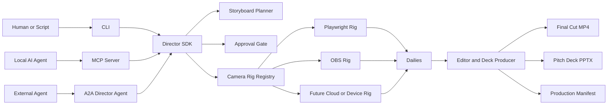

# A2A Director Agent

This guide explains how Agent-to-Agent (A2A) fits Director as a presentation production tool.

**Audience**: Developers and agent builders integrating Director into AI workflows.

**Status**: Stretch preview. The CLI and SDK are the source of truth, MCP is the local agent adapter, and A2A is the long-term network-facing Director Agent shape.

## What A2A Means Here

For Director, A2A is the protocol-shaped front door for asking a Director Agent to produce a live-application presentation.

Instead of a human running every command, another agent can delegate a production job:

```text
Create a narrated product walkthrough for this app.
Focus on onboarding, the admin dashboard, and the first successful action.
Return a video, pitch deck, manifest, and dailies.
```

The Director Agent turns that request into a governed production flow:

1. Scout the app.
2. Draft a storyboard.
3. Ask for approval before shooting.
4. Drive a camera rig.
5. Render the Final Cut and Pitch Deck.
6. Return artifacts.

A2A is the production office. It is not the camera rig. The camera rig still does the actual capture through Playwright, OBS, a cloud browser, a mobile device, or a future registered rig.

## Where It Fits

Use the interfaces in this order:

| Interface | Best For | Runs Where |
| --- | --- | --- |
| CLI | Humans, scripts, and first-time local automation | Local machine |
| SDK | Product integrations and custom automation | Local process or service |
| MCP | Local AI agents that need tool calls | Local machine |
| A2A | Other agents delegating production jobs over a network | Local service, private network, or hosted service |

The core rule is simple: adapters call the SDK. They should not reimplement production behavior.



## Director Concepts In A2A

Director concepts map cleanly onto A2A concepts:

| Director Concept | A2A Concept |
| --- | --- |
| Production job | Task |
| Storyboard approval | Input-required task state |
| Scene and shot progress | Streaming task updates |
| Storyboard | Artifact |
| Dailies | Artifact collection |
| Final Cut | Artifact |
| Pitch Deck | Artifact |
| Production Manifest | Artifact |

The A2A adapter should expose production skills, not low-level browser actions. A remote caller should ask Director to create a presentation, not micromanage every click unless the approved storyboard requires it.

## Skills

The A2A-shaped adapter exposes these skills:

- `scout_app`
- `draft_storyboard`
- `validate_storyboard`
- `shoot_presentation`
- `premiere_presentation`

Longer term, `get_dailies` and production-status inspection can become first-class A2A skills if external agents need richer review loops.

## Task Lifecycle

A typical A2A production should move through states like this:

```text
submitted
working: scouting app
working: drafting storyboard
input-required: approve storyboard and production settings
working: shooting scenes
working: rendering Final Cut
working: creating Pitch Deck
completed: artifacts are available
```

If the Director cannot safely proceed, it should stop at `input-required` with a clear request. Examples include missing approval, missing credentials, an unreachable app, a failed camera rig preflight, or a storyboard that tries to access private systems unexpectedly.

## Local Versus Hosted Use

A2A can sit on the internet, but the safest early shape is still local or private-network deployment.

Local and private-network A2A are useful when productions need:

- Localhost apps.
- Private staging environments.
- Browser sessions and local credentials.
- OBS or hardware capture.
- Filesystem artifacts.
- Human approval at the workstation.

Hosted A2A becomes useful when Director grows into a studio service:

- Agents can submit production jobs from other platforms.
- Teams can track production status remotely.
- A hosted Director can delegate capture to registered local rigs.
- Finished videos, decks, manifests, and dailies can be returned as governed artifacts.

The hosted Director should not automatically gain access to private apps. It should delegate capture to an approved camera rig that already has the right network position and credentials.

## Approval And Safety

A2A must preserve the same approval gates as the CLI and MCP adapters.

Agents may scout, draft, and validate storyboards without approval. Shooting and premiering require explicit approval unless the operator has configured trusted automation with `DIRECTOR_APPROVED=1` or an equivalent approved task payload.

The A2A adapter should avoid accepting raw secrets in task messages. Use environment variables, local credential stores, or rig-specific secret handling instead. Storyboards, dailies, Final Cuts, Pitch Decks, and manifests must not expose passwords, API keys, bearer tokens, session cookies, or private customer data.

## Example Flow

An external agent sends a production request:

```json
{
  "skill": "premiere_presentation",
  "input": {
    "url": "http://localhost:3000",
    "brief": "Create a narrated walkthrough of onboarding and the admin dashboard.",
    "audience": "Enterprise buyers evaluating the app",
    "approved": false
  }
}
```

Director responds with an approval gate after drafting the storyboard:

```json
{
  "state": "input-required",
  "message": "Approve the storyboard before shooting.",
  "artifacts": [
    {
      "name": "storyboard.yaml",
      "type": "application/yaml"
    }
  ]
}
```

After approval, Director shoots, renders, and returns artifacts:

```json
{
  "state": "completed",
  "artifacts": [
    { "name": "final-cut.mp4", "type": "video/mp4" },
    { "name": "pitch-deck.pptx", "type": "application/vnd.openxmlformats-officedocument.presentationml.presentation" },
    { "name": "production-manifest.json", "type": "application/json" }
  ]
}
```

## Current Adapter

Run the local A2A-shaped adapter:

```bash
npm run director -- a2a --port 4129
```

Agent Card:

```text
http://localhost:4129/.well-known/agent-card.json
```

A2A endpoint:

```text
http://localhost:4129/a2a
```

## Product Direction

The ideal long-term role for A2A is a remote Director Agent that receives production assignments and coordinates capture through a Camera Rig Registry.

That registry can later route jobs to:

- Local Playwright rigs.
- OBS studio rigs.
- Cloud browser rigs.
- Tailnet or private-network rigs.
- Mobile device rigs.

This keeps the Director Agent product-shaped while preserving local control over sensitive capture environments.

## Related Docs

- [User Guide](./USER_GUIDE.md)
- [Release Checklist](./RELEASE.md)
- [Security Sweep](./SECURITY_SWEEP.md)
